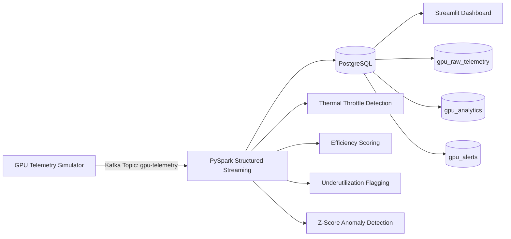

# GPU Cluster Health & Utilization Streaming Monitor

A real-time data engineering pipeline that simulates, processes, and visualizes
GPU telemetry from a 12-GPU compute cluster — built to demonstrate production-grade
streaming architecture using Apache Kafka, PySpark Structured Streaming, PostgreSQL,
and Streamlit.

---

## Architecture



---

## Features

- **Real-time ingestion** — Kafka producer emits correlated GPU telemetry at 12 events/sec (temperature rises with utilization, power follows load, errors cluster under stress)
- **Streaming analytics** — PySpark foreachBatch processes 120 rows every 10 seconds
- **Four detection algorithms** running every micro-batch:
  - Thermal throttling: `max_temp > 83C AND avg_util < 60%`
  - Efficiency scoring: weighted composite of utilization and memory bandwidth
  - Underutilized node detection: `avg_util < 25%`
  - Cluster-level anomaly detection via z-score: `(gpu_util - cluster_mean) / stddev > 2.5`
- **Three-tier PostgreSQL storage** — raw telemetry, aggregated analytics, and alerts-only tables
- **Live Streamlit dashboard** — 5-panel UI with Plotly charts, auto-refreshes every 10 seconds

---

## Tech Stack

| Layer | Technology |
|---|---|
| Message Broker | Apache Kafka 7.5 + Zookeeper |
| Stream Processing | PySpark 3.5.1 Structured Streaming |
| Storage | PostgreSQL 15 |
| Dashboard | Streamlit 1.32 + Plotly |
| Orchestration | Docker Compose |
| Language | Python 3.11 |

---

## Project Structure
gpu-cluster-monitor/
├── producer/
│   ├── simulator.py          # GPU telemetry Kafka producer
│   ├── Dockerfile
│   └── requirements.txt
├── spark_consumer/
│   ├── consumer.py           # PySpark Structured Streaming analytics
│   ├── Dockerfile
│   └── requirements.txt
├── dashboard/
│   ├── app.py                # Streamlit live dashboard
│   ├── Dockerfile
│   └── requirements.txt
├── postgres/
│   └── init/
│       └── 01_schema.sql     # Auto-applied schema on first run
├── config/
│   └── kafka_config.py       # Shared constants
├── docker-compose.yml
└── .env

---

## Quick Start

**Prerequisites:** Docker Desktop, Git

```bash
git clone https://github.com/harshvekaria/gpu-cluster-monitor.git
cd gpu-cluster-monitor

# Start infrastructure
docker compose up -d zookeeper kafka postgres

# Wait 20 seconds, then start producer
docker compose up -d kafka-ui producer

# Wait 15 seconds for topic creation, then start consumer and dashboard
docker compose up -d --build spark-consumer dashboard
```

| Service | URL |
|---|---|
| Streamlit Dashboard | http://localhost:8501 |
| Kafka UI | http://localhost:8080 |

---

## Dashboard Panels

| Panel | Description |
|---|---|
| Cluster KPIs | Total GPUs, avg utilization, avg temp, alert counts |
| GPU Health Map | 12-card grid colored by health status |
| Efficiency Rankings | Horizontal bar chart ranked by efficiency score |
| Temperature Time Series | Rolling 5-min lines with 83C throttle threshold |
| Recent Alerts | Live feed of CRITICAL / WARNING / LOW_UTIL events |
| Utilization Bar Chart | All 12 GPUs with under/overload threshold lines |

---

## Key Design Decisions

**Why Kafka + PySpark over Spark alone?**
Kafka decouples producers from consumers. The telemetry simulator runs independently,
and multiple consumers can subscribe to the same topic simultaneously — for example,
a separate alerting microservice alongside the analytics engine.

**Why foreachBatch instead of native streaming sinks?**
foreachBatch gives full DataFrame API access inside each micro-batch, enabling
multi-table writes (raw + analytics + alerts) in a single pass with custom business
logic per table — not possible with native sinks alone.

**Why three PostgreSQL tables?**
Raw telemetry preserves every reading for replay and audit. Analytics stores
aggregated results for fast dashboard queries. Alerts is a filtered subset
enabling instant lookups without scanning millions of raw rows.

---

## Author

**Harsh Vekaria**
MS Software Engineering — University of Texas at Arlington

[](https://linkedin.com/in/harshvekaria)
[](https://github.com/harshvekaria)